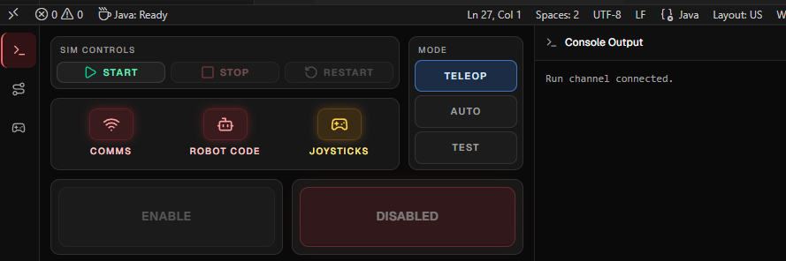
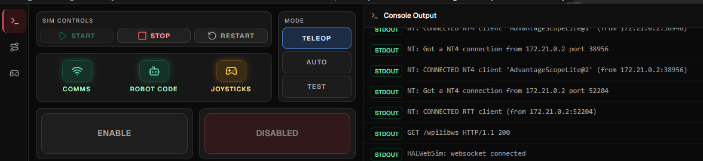
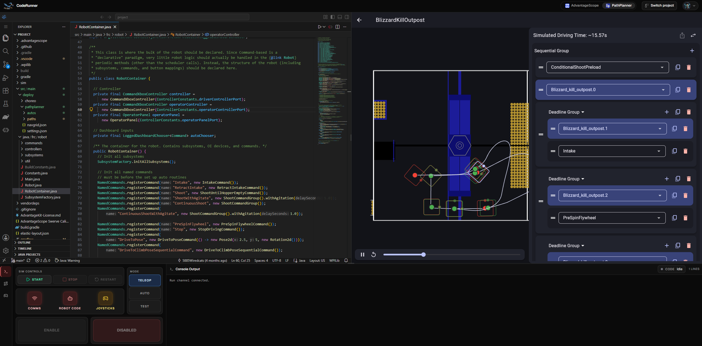

# Using CodeRunner

## Get started

1. Sign in.
2. Click **Switch project**, then load a lesson or import a public GitHub project.
3. For a lesson, select **Preview** to read its README and follow the
   instructions. For an imported project, open the files you want to work on.

:::warning[Switching projects discards your current workspace]

Switching or resetting replaces your current files. For an imported project,
commit and push any work you want to keep.

:::

## Robot lessons and imported projects

:::important[Start the simulation from CodeRunner]

The WPILib extension can start a simulation, but you should not use it here.
Click **Start** in the Driver Station at the bottom of the page so CodeRunner
can use its supported headless simulation setup and connect the controls and
telemetry. Standalone builds can still be run from the extension when you only
want to compile and check your code.

:::

1. Click **Start** in the Driver Station.
2. Wait for **Comms** and **Robot Code** to turn green.

3. Select **Teleop**, **Auto**, or **Test**, then click **Enable**.
4. Click **Stop** when you are finished, or **Restart** to stop the code and re-run with any changes you've made.

Build output and robot output appear in the **Console** tab. Use the top-bar
**AdvantageScope**, **PathPlanner** and **Preview** tabs to switch the tool
beside the editor. AdvantageScope opens by default, and switching tabs does not
reload any of them.

Drag the dividers to resize panes. Use the caret buttons or **User menu → Layout**
to change the layout.

## PathPlanner

For robot lessons and imported projects, the **PathPlanner** tab opens the path
editor. For path and auto editing basics, see the
[official PathPlanner guide](https://pathplanner.dev/gui-editing-paths-and-autos.html).

PathPlanner writes to `src/main/deploy/pathplanner/**` in the current project.
Files under `src/main/deploy/choreo/**` are visible but read-only.
If you edit a PathPlanner file directly in VSCodium, refresh the CodeRunner page
before looking for that change in PathPlanner. Switching or resetting the
project reloads PathPlanner with the new project's files.

PathPlanner robot telemetry and hot reload are not connected. Use AdvantageScope
for simulated robot telemetry.

## Preview

Use **Preview** to read project Markdown and HTML reports beside the editor. A
root `README.md` opens automatically; use the searchable picker to find other
documents by name or path, including generated files under `build/reports/**`.

Click **Refresh** after a build or edit to see updated changes.

## Console lessons

`Console` type lessons are pure Java exercises, not robot projects. Because they
do not run a robot simulation, the simulation tools and Driver Station are
hidden and the VS Code editor expands to fill the screen. Use the editor's
**Run** button to run them.

The top bar still offers a **Preview** button for instructions and reports.

## Explore more

While a robot simulation is running, explore the Driver Station's **Auto** and
**Controls** tabs. **Auto** appears when the robot code publishes an autonomous
chooser; **Controls** lets you select a gamepad or keyboard input to control the
simulation.
